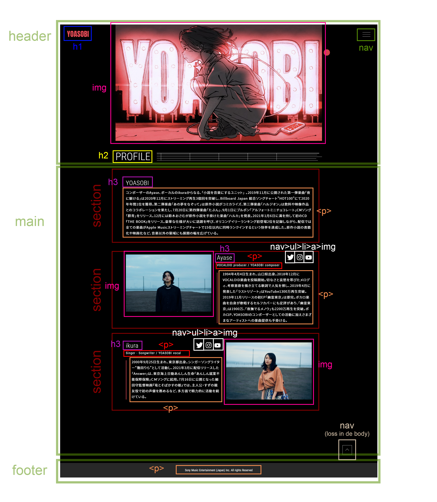
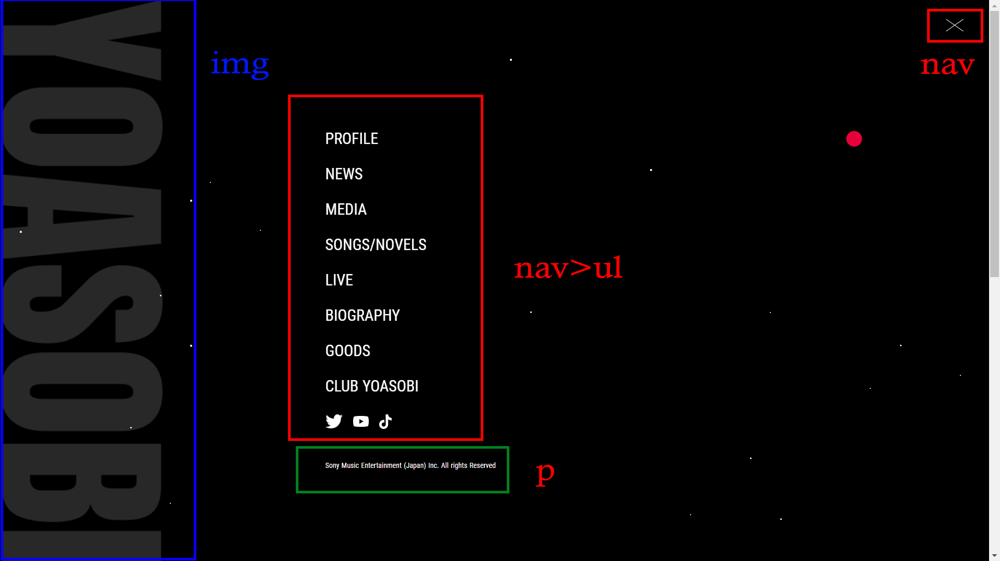
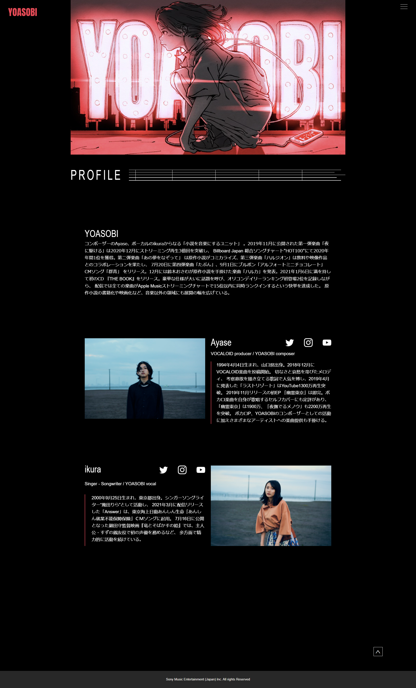
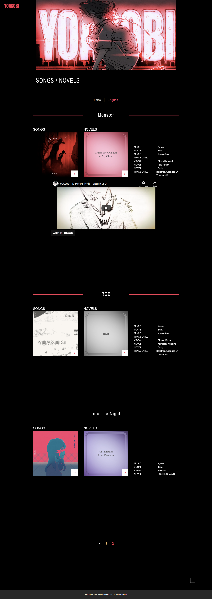

# Procesverslag

Markdown is een simpele manier om HTML te schrijven.  
Markdown cheat cheet: [Hulp bij het schrijven van Markdown](https://github.com/adam-p/markdown-here/wiki/Markdown-Cheatsheet).

Nb. De standaardstructuur en de spartaanse opmaak van de README.md zijn helemaal prima. Het gaat om de inhoud van je procesverslag. Besteedt de tijd voor pracht en praal aan je website.

Nb. Door *open* toe te voegen aan een *details* element kun je deze standaard open zetten. Fijn om dat steeds voor de relevante stuk(ken) te doen.

## Jij

uitwerken voor kick-off werkgroep

### Auteur:
Sundous Kanaan

#### Je startniveau:
Rood
 
#### Je focus:
Surface plane
<!-- 1- Dark/Light mode 
2- Custom properties++ (voor meer dan kleur, aanpassen met JS…)
3- Advanced positioning: sticky, fixed, z-index…

4- Custom properties
5- Scroll animaties (id & scroll-behaviour, intersection observer…)
 -->
 

## Je website

uitwerken voor kick-off werkgroep

### Je opdracht:
https://www.yoasobi-music.jp/profile

#### Screenshot(s) van de eerste pagina (small screen): 
PROFILE (Home page)
<!--  -->

#### Screenshot(s) van de tweede pagina (small screen):
SONGS / NOVELS
<!--  -->

 

## Breakdownschets (week 1)

uitwerken na afloop 2e werkgroep

### de hele pagina: 
<!--  -->

 
### dynamisch deel (bijv menu): 
<!--  -->
 

<!-- ### wellicht nog een dynamisch deel (bijv filter): 
 -->

## Voortgang 1 (week 2)

uitwerken voor 1e voortgang

### Stand van zaken
Alles werkt goed tot nu toe. Ik heb geprobeerd het grids te gebruiken en we hebben het nog niet bestudeerd, 
het werkte prima, maar er zijn enkele commando's die ik niet kende en die ik moet toevoegen of corrigeren.
Mijn code is netjes, maar er zijn enkele verbeterpunten nodig, zoals het definiëren van de taal in sommige delen van de tekst, 
 omdat de site zowel Japanse en Engelse talen bevat.

### Agenda voor meeting
samen met je groepje opstellen
 
Marc:
 - Beter en duidelijker namen voor de variabele geven (custom properties).
 - Font sizen
 - Skip niet de main element in de code dan kan de screen reader niet de elementen
   van main vinden en gaat hun skippen.
 - De list elementen moeten gelijk zijn.
 
Tabita:
 - De volgorde van de HTML elementen fixen.
 - <time>: The (Date) Time element gebruiken.
 - Ze heeft een probleem met ruimte tussen de foto's, die mag niet zijn.
 - Het gebruiken van position Property.
 
Ik:
- Spacing in mijn tekst.
- Ik heb geprobeerd om grid te gebruiken.
 
### Verslag van meeting
hier na afloop snel de uitkomsten van de meeting vastleggen

- Heb ik mijn HTML volgorde gefixt
- <time>: The (Date) Time element gebruiken.
- Spacing in mijn tekst was een font probleem.
- Definieer de taal van de site en de tekst met een span  want mijn site gebruikt Engels en Japans.
- Met de uitleg van de volgende les over de grid wordt duidelijker.

## Voortgang 2 (week 3)

uitwerken voor 2e voortgang

### Stand van zaken
hier dit ging goed & dit was lastig (neem ook screenshots op van delen van je website en code)
 
Alles van de site basis ging goed volgens de lessen van de vorige weken, maar in dit punt heb ik nog twee probleemen
- Ik heb allen dit screenshot van mijn grid probleem, waar mijn nav elementen staan niet in zijn section grid:

 
- Mijn snow effect moet in mijn menu terug komen:
 

 

### Agenda voor meeting
Marc:
 - Zijn pagina was klein en weinig werk voor wat hij kan doen, dus het advies was om misschien kan hij animaties voor de achtergrond maken, 
 die in de orginiele site niet staat.
 - Zijn font responsive maken tijdens het veranderen van de screen width bijvoorbeeld met clamp().
 
Tabita:
 - Haar foto's size aanpassen.
 - De navigatiemenu elementen verschijnen, zelfs als het menu niet is geopend.
 
 Ik:
 - De snow effect van de achtergrond in mijn menu ook terug zien.
 - Mijn grid van tweede pagina fixen.
 - Een hover/cursor:pointer voor mijn menu knop maken, want het is een drie los lijnen en het is niet duidelijk, 
 als je moet ergens oop de knop klicken of moet dat op de lijnen.
 - Ik heb met de browser scherm beginnen, maar dat is fout, want ik moet met mobile scherm beginnen en nu ben ik klaar met de eerste pagina, 
 mijn menu en bijna de helft van de tweede, dus moet ik Sanna vraggen wat ik nu moet doen.
 
### Verslag van meeting
hier na afloop snel de uitkomsten van de meeting vastleggen

- Ik had een probleem met de grid van pagina 2, maar het hulp van de student assisstenten had ik duidelijker beeld over de grid en hoe kan ik mijn probleem fixen.
 Als ik wil elementen in mijn grid positioneren die een parent hebben, moet ik eerste de parent in de grid positineren en dan zijn childeren positineren.
 
- Mijn achtergrond animatie is prima maar het moet ook in mijn navigatie menu komen, ze hebben ook geprobeerd om het te fixen en uitleggen hoe kan dat.
 
- Ik kan mijn code van de eerste pagina houden, en begin opniew met de mobile versie van de tweede pagina.

## Toegankelijkheidstest (week 4)

uitwerken na test in 8e voortgang

### Bevindingen
Lijst met je bevindingen die in de test naar voren kwamen:

#### Navigeren met toetsenbord
Mijn navigatie door de toetsenbord werkt goed en je kan wel navegeren tussen de twee pagina's en hun elementen.
 
#### Algemeen punten.
Dit was de eerste test, dus heb ik paar punten gevonden, die ik moet fixen in mijn css.
- Mijn Social media hebben niet de kleur die ik wild in de light mode:
  - 
  - 
 
- Ik heb de code van de dark mode gefixt
  - 
  - 

- Mijn footer font was zwart in plaats van wit in de light mode
   - 
   - 

 - Mijn menu knop ook was wit in plaats van zwart in de light mode
   - 
   - 

 - De light mode problemen heb ik in mijn @media gefixt en voor de menu knop ik heb zijn kleur variable gefixt
   - 

 
#### Gebruik screenreader
De screen reader leest alleen de hoofd kopjes en de links iconen maar niet de paragrafen.

 - ik moest te engels en japanse taal pakket

#### Visuele berperkingen
Ik heb mijn website duidelijk gevonden voor mensen met een (visuele) beperking, want hij heeft duidelijk bouwen en elementen.
 
 
#### Hulp aan de studenten assistent aanvragen:
- Ik heb mijn grid van de tweede pagina gemaakt, maar paar section hebben styling anders.
  Ik heb met de student assistenten dat opgelost door de elementen code te verwerken.
 - Section met goede styling:
   - 

 - Section met fout styling:
   - 

 - De styling komt hier van de eerste pagina en dat mag niet:
   - 
   - Hoe ik dit opgelost heb:
      - 

## Voortgang 3 (week 4)

uitwerken voor 3e voortgang

### Stand van zaken
Mijn website werkt prima en ik heb wel twee pagina's klaar, dus ik had niet te veel vragen over hem.

### Agenda voor meeting
Tabita:
 - Haar eerste pagina werkt goed.
 - Ze moet nog haar tweede pagina kiezen, maar de rest van de website pagina's zijn hetzelfde, als de styeling van de home pagina, 
 dus ze moet naar een pagina met andere styeling zoeken.
 
Ik:
 - Uitleg aanvragen over de fade effect tijdens scrollen.
 - vraag: Kan ik mijn snow effect divjes in mijn nav ook zitten om daar ook te werken?
 
### Verslag van meeting
- Alle px naar em veranderen
- Hoe moet ik mijn animatie tijdens scrollen laten werken
- Ik kan mijn snow effect divjes in mijn nav ook zitten

## Eindgesprek (week 5)

uitwerken voor eindgesprek

### Stand van zaken
 
 
- Ik ben blij dat mijn alle pagina's werken goed met ook de animaties erbij en de button states (de screenshots heeft geen de snow effect in het achtergrond genomen)
   - pagina 1
       - 
   - navigatie menu:
       - 
   - pagina 2 a:
       - 
   - pagina 2 b:
       - 

- Mijn code:
 
   - 
   - 
   - 
 

## Bronnenlijst

 
 - Ik heb een kleuren filter via een youtube video gehaald om mijn images kleur te veranderen
   - Youtube video: https://youtu.be/Ni49a8gZQxY
   - Codepen: https://codepen.io/sosuke/pen/Pjoqqp
 
- HTML backpijl & nextpijl code:
   - backpijl: https://unicode-table.com/en/2B9C/
   - nextpijl: https://unicode-table.com/en/2B9E/
 
- Snow effect animation
   - Codepen: https://codepen.io/Sundous/pen/mdByqym

